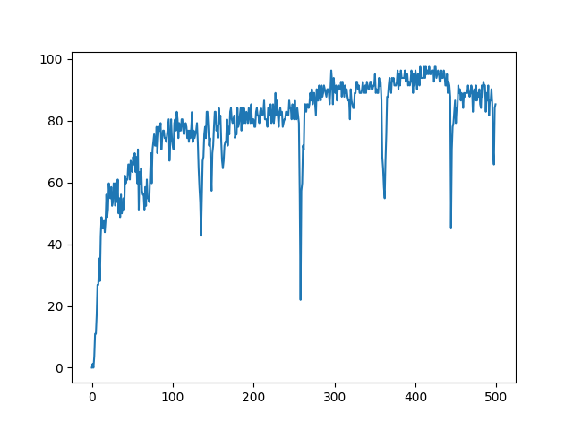

# Ticket bot (拓元, KKTIX 搶票機器人)

## Installation
```ruby
pip install -r requirements.txt
```
If you are using pytorch for captcha model(adopted from pytorch website):
```ruby
# CUDA 10.2
conda install pytorch==1.12.0 torchvision==0.13.0 torchaudio==0.12.0 cudatoolkit=10.2 -c pytorch
# CUDA 11.3
conda install pytorch==1.12.0 torchvision==0.13.0 torchaudio==0.12.0 cudatoolkit=11.3 -c pytorch
# CUDA 11.6
conda install pytorch==1.12.0 torchvision==0.13.0 torchaudio==0.12.0 cudatoolkit=11.6 -c pytorch -c conda-forge
# CPU Only
conda install pytorch==1.12.0 torchvision==0.13.0 torchaudio==0.12.0 cpuonly -c pytorch
```

## Getting started
### Step1: Find your browser execute path
Please find your MS Edge browser path and paste the path on top of  ticket_bot.py.
```ruby
browser_path = "YOUR_EDGE_BROWSER_PATH"
```
### Step2: Run
Please refer to run.ipynb
### Step3: Captcha model (optional)
Download captcha model and paste model path on top of ticket_bot.py 
```ruby
model_path = "YOUR_MODEL_PATH"
tixcraft = True
```
## Captcha model
### Model structure
ResNet18 + FPN + Transformer
| Model | Accuracy | Link |
| ---------- | -------- | ---- |
| Fine-tuned | 97.6% | [google drive](https://drive.google.com/file/d/1meln4tBvDGq0cXvwLyvONLJKgeQILdXw/view?usp=drive_link) |
### Traning strategy
Model is first trained on 20k captcha data generate by [captcha](https://pypi.org/project/captcha/) library, and then fine-tuned on 550 tixcraft captcha data. Model is trained using cross entropy loss with a batch size of 50 for 20 epochs and optimized by AdamW with learning rate 1e-3. For fine-tuning, model is trained for 500 epochs with batch size of 20 and learning rate is set to 2e-4.
### Accuracy on tixcraft validation data 

